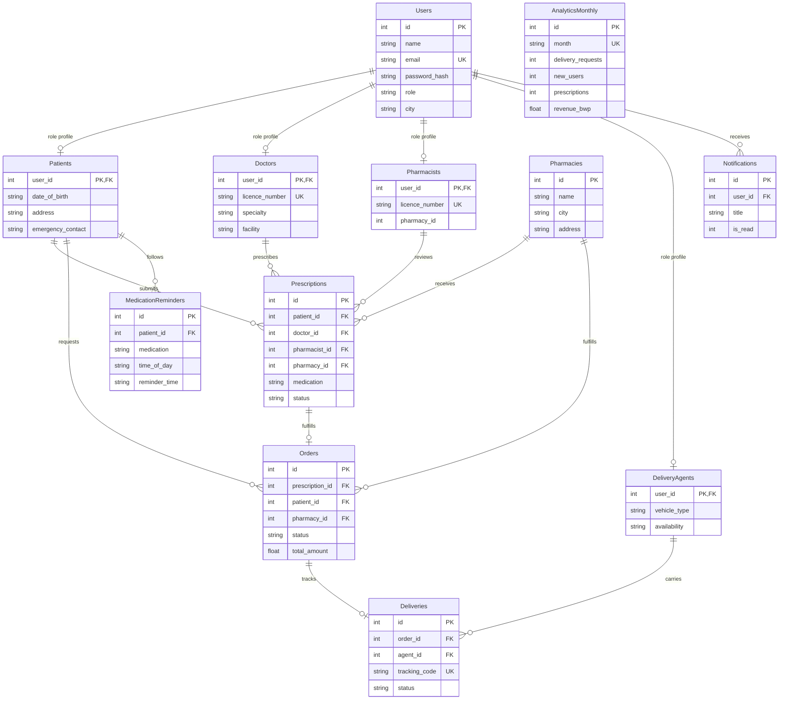
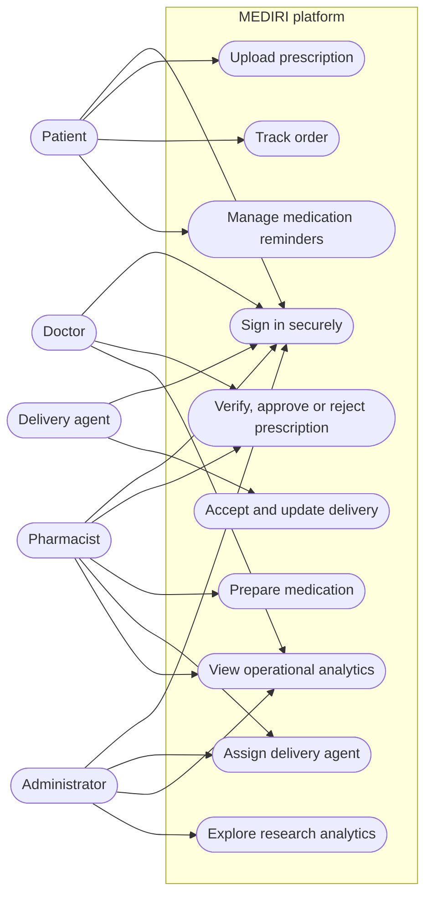
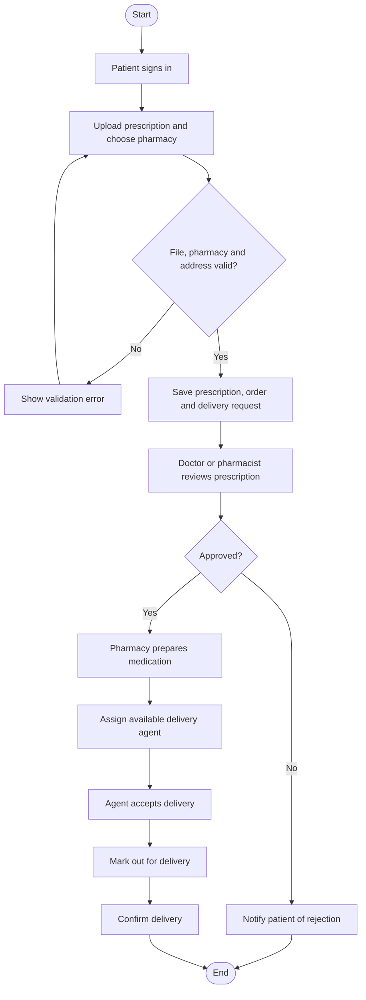
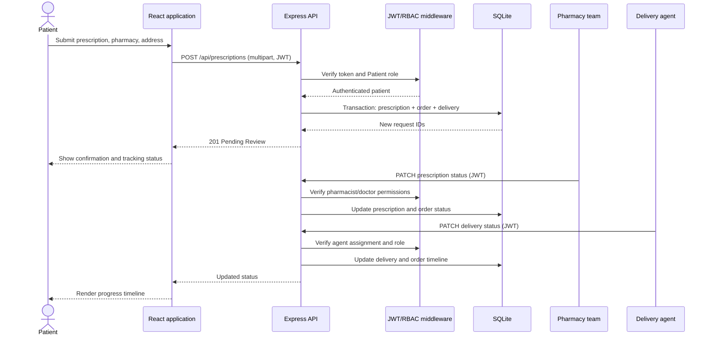
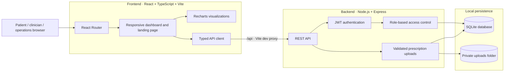

# MEDIRI system diagrams

## Mermaid ERD

```mermaid
erDiagram
    Users ||--o| Patients : "role profile"
    Users ||--o| Doctors : "role profile"
    Users ||--o| Pharmacists : "role profile"
    Users ||--o| DeliveryAgents : "role profile"
    Pharmacies ||--o{ Prescriptions : receives
    Pharmacies ||--o{ Orders : fulfills
    Patients ||--o{ Prescriptions : submits
    Doctors ||--o{ Prescriptions : prescribes
    Pharmacists ||--o{ Prescriptions : reviews
    Prescriptions ||--o| Orders : fulfills
    Patients ||--o{ Orders : requests
    Orders ||--o| Deliveries : tracks
    DeliveryAgents ||--o{ Deliveries : carries
    Users ||--o{ Notifications : receives
    Patients ||--o{ MedicationReminders : follows

    Users {
        int id PK
        string name
        string email UK
        string password_hash
        string role
        string city
    }
    Patients {
        int user_id PK,FK
        string date_of_birth
        string address
        string emergency_contact
    }
    Doctors {
        int user_id PK,FK
        string licence_number UK
        string specialty
        string facility
    }
    Pharmacists {
        int user_id PK,FK
        string licence_number UK
        int pharmacy_id
    }
    DeliveryAgents {
        int user_id PK,FK
        string vehicle_type
        string availability
    }
    Pharmacies {
        int id PK
        string name
        string city
        string address
    }
    Prescriptions {
        int id PK
        int patient_id FK
        int doctor_id FK
        int pharmacist_id FK
        int pharmacy_id FK
        string medication
        string status
    }
    Orders {
        int id PK
        int prescription_id FK
        int patient_id FK
        int pharmacy_id FK
        string status
        float total_amount
    }
    Deliveries {
        int id PK
        int order_id FK
        int agent_id FK
        string tracking_code UK
        string status
    }
    Notifications {
        int id PK
        int user_id FK
        string title
        int is_read
    }
    MedicationReminders {
        int id PK
        int patient_id FK
        string medication
        string time_of_day
        string reminder_time
    }
    AnalyticsMonthly {
        int id PK
        string month UK
        int delivery_requests
        int new_users
        int prescriptions
        float revenue_bwp
    }
```

## Use-case diagram

```mermaid
flowchart LR
    Patient([Patient])
    Doctor([Doctor])
    Pharmacist([Pharmacist])
    Agent([Delivery agent])
    Admin([Administrator])
    subgraph Mediri["MEDIRI platform"]
        Auth([Sign in securely])
        Submit([Upload prescription])
        Follow([Track order])
        Remind([Manage medication reminders])
        Review([Verify, approve or reject prescription])
        Prepare([Prepare medication])
        Assign([Assign delivery agent])
        Deliver([Accept and update delivery])
        Analytics([View operational analytics])
        Research([Explore research analytics])
    end
    Patient --> Auth
    Patient --> Submit
    Patient --> Follow
    Patient --> Remind
    Doctor --> Auth
    Doctor --> Review
    Pharmacist --> Auth
    Pharmacist --> Review
    Pharmacist --> Prepare
    Pharmacist --> Assign
    Agent --> Auth
    Agent --> Deliver
    Admin --> Auth
    Admin --> Assign
    Admin --> Analytics
    Admin --> Research
    Doctor --> Analytics
    Pharmacist --> Analytics
```

## Activity diagram

```mermaid
flowchart TD
    Start([Start]) --> Login[Patient signs in]
    Login --> Upload[Upload prescription and choose pharmacy]
    Upload --> Validate{File, pharmacy and address valid?}
    Validate -- No --> Correct[Show validation error]
    Correct --> Upload
    Validate -- Yes --> Save[Save prescription, order and delivery request]
    Save --> Review[Doctor or pharmacist reviews prescription]
    Review --> Decision{Approved?}
    Decision -- No --> Reject[Notify patient of rejection]
    Decision -- Yes --> Prepare[Pharmacy prepares medication]
    Prepare --> Assign[Assign available delivery agent]
    Assign --> Accept[Agent accepts delivery]
    Accept --> Transit[Mark out for delivery]
    Transit --> Delivered[Confirm delivery]
    Reject --> End([End])
    Delivered --> End
```

## Sequence diagram

```mermaid
sequenceDiagram
    actor Patient
    participant UI as React application
    participant API as Express API
    participant Auth as JWT/RBAC middleware
    participant DB as SQLite
    participant Pharmacy as Pharmacy team
    participant Agent as Delivery agent
    Patient->>UI: Submit prescription, pharmacy, address
    UI->>API: POST /api/prescriptions (multipart, JWT)
    API->>Auth: Verify token and Patient role
    Auth-->>API: Authenticated patient
    API->>DB: Transaction: prescription + order + delivery
    DB-->>API: New request IDs
    API-->>UI: 201 Pending Review
    UI-->>Patient: Show confirmation and tracking status
    Pharmacy->>API: PATCH prescription status (JWT)
    API->>Auth: Verify pharmacist/doctor permissions
    API->>DB: Update prescription and order status
    Agent->>API: PATCH delivery status (JWT)
    API->>Auth: Verify agent assignment and role
    API->>DB: Update delivery and order timeline
    API-->>UI: Updated status
    UI-->>Patient: Render progress timeline
```

## System architecture diagram

```mermaid
flowchart LR
    Browser[Patient / clinician / operations browser]
    subgraph Frontend["Frontend · React + TypeScript + Vite"]
        Router[React Router]
        UI[Responsive dashboard and landing page]
        Charts[Recharts visualizations]
        Client[Typed API client]
        Router --> UI
        UI --> Charts
        UI --> Client
    end
    subgraph Backend["Backend · Node.js + Express"]
        REST[REST API]
        JWT[JWT authentication]
        RBAC[Role-based access control]
        Upload[Validated prescription uploads]
        REST --> JWT --> RBAC
        REST --> Upload
    end
    subgraph Persistence["Local persistence"]
        SQLite[(SQLite database)]
        Files[(Private uploads folder)]
    end
    Browser --> Router
    Client -->|/api · Vite dev proxy| REST
    RBAC --> SQLite
    Upload --> Files
    Upload --> SQLite
```
